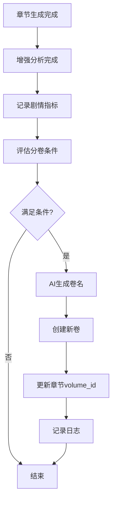

# 自动分卷功能实施方案（改进版）

**日期**: 2025-10-30  
**状态**: ✅ 已实现  
**版本**: v2.0（基于原方案改进）

---

## 📋 目录

1. [总体流程](#总体流程)
2. [数据模型](#数据模型)
3. [指标聚合](#指标聚合)
4. [分卷判定](#分卷判定)
5. [卷名生成](#卷名生成)
6. [集成点](#集成点)
7. [配置说明](#配置说明)
8. [测试验证](#测试验证)

---

## 1. 总体流程



### 详细步骤

1. **章节生成完成** - `AutoGeneratorService._process_enhanced_mode` 或异步增强处理器收尾
2. **记录剧情指标** - 解析增强分析结果 & 摘要 → 写入 `chapter_story_metrics`
3. **评分判定** - `VolumeSplitService.evaluate_project()` 读取最近 N 章指标
4. **命中条件** - 创建新卷、更新 `Chapter/ChapterOutline` 的 `volume_id`
5. **AI 命名** - 构造提示词（附最近重大事件摘要）调用指定模型生成卷名
6. **日志记录** - "自动创建卷五·星陨之夜（第 46-60 章，评分 72，大事件：宗门覆灭）"

---

## 2. 数据模型

### 新增表：`chapter_story_metrics`

```sql
CREATE TABLE chapter_story_metrics (
    id SERIAL PRIMARY KEY,
    project_id VARCHAR(36) NOT NULL,
    chapter_id BIGINT NOT NULL,
    chapter_number INT NOT NULL,
    
    -- 基础指标
    word_count INT DEFAULT 0,
    
    -- 事件指标
    key_event_count INT DEFAULT 0,
    major_event_flag BOOLEAN DEFAULT FALSE,
    
    -- 伏笔指标
    foreshadow_count INT DEFAULT 0,
    foreshadow_max_conf DOUBLE PRECISION DEFAULT 0,
    
    -- 角色与世界观
    character_breakthrough_flag BOOLEAN DEFAULT FALSE,
    world_shock_flag BOOLEAN DEFAULT FALSE,
    
    -- 评分
    climax_score INT DEFAULT 0,        -- 高潮评分(0-100)
    stage_score INT DEFAULT 0,         -- 综合评分(0-100)
    
    -- 原始数据快照
    metrics JSONB,
    
    created_at TIMESTAMPTZ DEFAULT now(),
    updated_at TIMESTAMPTZ DEFAULT now(),
    
    UNIQUE(project_id, chapter_number)
);
```

### 字段说明

| 字段 | 类型 | 说明 |
|------|------|------|
| `key_event_count` | INT | 关键事件数量 |
| `major_event_flag` | BOOLEAN | 是否有重大事件（角色突破/高潮伏笔） |
| `foreshadow_count` | INT | 伏笔数量 |
| `foreshadow_max_conf` | FLOAT | 伏笔最高置信度 |
| `character_breakthrough_flag` | BOOLEAN | 角色是否突破（成长等级>=5） |
| `world_shock_flag` | BOOLEAN | 世界观是否震撼（有新增元素） |
| `climax_score` | INT | 高潮评分（基于事件密度和类型） |
| `stage_score` | INT | 综合阶段评分（加权计算） |
| `metrics` | JSONB | 原始指标快照（用于调试和重算） |

---

## 3. 指标聚合

### 服务：`StoryMetricsService`

#### 核心方法

```python
class StoryMetricsService:
    @classmethod
    async def record_metrics(
        cls,
        db: AsyncSession,
        project_id: str,
        chapter_id: int,
        chapter_number: int,
        enhanced_result: dict,
        summary_result: dict,
        word_count: int,
        config: Optional[dict] = None
    ) -> dict:
        """记录章节剧情指标"""
```

#### 评分算法（改进版）

```python
def _compute_stage_score(metrics: dict, weights: dict) -> int:
    score = 0.0
    
    # 关键事件（每条 +8分）
    score += metrics["key_event_count"] * weights["key_event"]
    
    # 伏笔（每条 +5分，置信度 * 10）
    score += metrics["foreshadow_count"] * weights["foreshadow"]
    score += metrics["foreshadow_max_conf"] * weights["foreshadow_conf"]
    
    # 角色突破 +20分
    if metrics["character_breakthrough_flag"]:
        score += weights["character_breakthrough"]
    
    # 世界观震撼 +15分
    if metrics["world_shock_flag"]:
        score += weights["world_shock"]
    
    # 重大事件 +25分
    if metrics["major_event_flag"]:
        score += weights["major_event"]
    
    # 高潮章节加成（评分>=70时 * 1.2）
    if metrics["climax_score"] >= 70:
        score *= weights["climax_multiplier"]
    
    return min(int(score), 100)
```

#### 默认权重

```python
DEFAULT_WEIGHTS = {
    "key_event": 8,
    "foreshadow": 5,
    "foreshadow_conf": 10,
    "character_breakthrough": 20,
    "world_shock": 15,
    "major_event": 25,
    "climax_multiplier": 1.2,
}
```

---

## 4. 分卷判定

### 服务：`VolumeSplitService`

#### 判定逻辑

```python
async def evaluate_project(
    self,
    project_id: str,
    task_id: Optional[int] = None,
    config: Optional[dict] = None
) -> Optional[Volume]:
    """评估项目是否需要分卷"""
    
    # 1. 检查最小章节数
    if chapters_since_last < config["min_chapters"]:
        return None
    
    # 2. 强制分卷（达到最大章节数）
    if chapters_since_last >= config["max_chapters"]:
        return await self._create_volume(reason="达到最大章节数")
    
    # 3. 检查冷却期
    if chapters_since_last < config["min_chapters"] + config["cooldown_chapters"]:
        return None
    
    # 4. 加载评分窗口
    metrics_window = await self._load_metrics_window(
        window_size=config["window_size"]
    )
    
    # 5. 评分判定
    avg_score = statistics.mean(m.stage_score for m in metrics_window)
    has_major_event = any(m.major_event_flag for m in metrics_window)
    max_score = max(m.stage_score for m in metrics_window)
    
    # 6. 判定是否分卷
    should_split = (
        avg_score >= config["score_threshold"] or 
        has_major_event or
        max_score >= 80  # 单章高分也触发
    )
    
    if should_split:
        return await self._create_volume(...)
```

#### 触发条件（三选一）

1. **平均评分达标** - 窗口内平均 `stage_score` >= 阈值（默认60）
2. **重大事件** - 窗口内任一章节 `major_event_flag = true`
3. **单章高潮** - 窗口内任一章节 `stage_score >= 80`

---

## 5. 卷名生成

### AI 提示词

```python
def _build_naming_prompt(
    volume_number: int,
    start_chapter: int,
    end_chapter: int,
    metrics_window: List[ChapterStoryMetrics]
) -> str:
    highlights = []
    for m in metrics_window:
        if m.major_event_flag:
            highlights.append(f"第{m.chapter_number}章触发重大事件（评分{m.stage_score}）")
    
    return f"""请为小说的第{volume_number}卷生成一个富有诗意和吸引力的卷名。

**卷信息**:
- 卷号: 第{volume_number}卷
- 章节范围: 第{start_chapter}-{end_chapter}章
- 重大事件:
{highlights_text}

**要求**:
1. 卷名格式: "卷{中文数字}·<副标题>"
2. 副标题应简洁有力，2-6个字
3. 体现本卷的核心剧情或主题
4. 富有诗意和想象力
5. 只返回卷名，不要其他解释

**示例**:
- 卷一·初入江湖
- 卷二·星陨之夜
- 卷三·破境之路

请生成卷名:"""
```

### Fallback 策略

```python
# AI 失败时使用默认格式
fallback_title = f"卷{中文数字}·第{start_chapter}-{end_chapter}章"
```

---

## 6. 集成点

### 6.1 异步处理器集成

**文件**: `backend/app/services/async_analysis_processor.py`

```python
async def _process_single_task(self, pending_id: int):
    # ... 执行增强分析 ...
    
    if result:
        # 保存结果
        pending.status = 'completed'
        await db.commit()
        
        # ✅ 记录剧情指标
        await self._record_story_metrics(db, pending, result)
        
        # ✅ 评估自动分卷
        await self._evaluate_volume_split(db, pending)
```

### 6.2 同步模式集成（可选）

**文件**: `backend/app/services/auto_generator_service.py`

```python
@classmethod
async def _process_enhanced_mode(cls, ...):
    # ... 增强分析 ...
    
    # 如果是同步模式，也可以在这里调用
    from .story_metrics_service import StoryMetricsService
    from .volume_split_service import VolumeSplitService
    
    await StoryMetricsService.record_metrics(...)
    await VolumeSplitService(db, llm_service).evaluate_project(...)
```

---

## 7. 配置说明

### 配置位置

`generation_config` 中添加 `volume_split` 节点：

```json
{
  "volume_split": {
    "enabled": true,
    "min_chapters": 15,
    "max_chapters": 30,
    "window_size": 5,
    "score_threshold": 60,
    "cooldown_chapters": 3,
    "naming_model": "deepseek-chat",
    "naming_timeout": 30,
    "fallback_naming": true,
    "metrics_weights": {
      "key_event": 8,
      "foreshadow": 5,
      "foreshadow_conf": 10,
      "character_breakthrough": 20,
      "world_shock": 15,
      "major_event": 25,
      "climax_multiplier": 1.2
    }
  }
}
```

### 配置字段说明

| 字段 | 类型 | 默认值 | 说明 |
|------|------|--------|------|
| `enabled` | boolean | true | 是否启用自动分卷 |
| `min_chapters` | int | 15 | 最少章节数（低于此值不分卷） |
| `max_chapters` | int | 30 | 最多章节数（达到强制分卷） |
| `window_size` | int | 5 | 评分窗口大小（最近N章） |
| `score_threshold` | int | 60 | 平均评分阈值 |
| `cooldown_chapters` | int | 3 | 冷却章节数（防抖） |
| `naming_model` | string | "deepseek-chat" | AI命名使用的模型 |
| `naming_timeout` | int | 30 | AI命名超时（秒） |
| `fallback_naming` | boolean | true | AI失败时使用fallback |
| `metrics_weights` | object | {...} | 指标权重配置 |

---

## 8. 测试验证

### 8.1 单元测试

**文件**: `backend/tests/test_story_metrics.py`

```python
async def test_metrics_calculation():
    """测试指标计算"""
    metrics = StoryMetricsService._extract_metrics(
        enhanced_result={
            "foreshadowings": [{"type": "climax", "confidence": 0.9}],
            "character_changes": [{"growth_level": 6}],
            "world_extensions": {"magic_system": ["新法术"]}
        },
        summary_result={"key_events": ["事件1", "事件2"]},
        word_count=3000
    )
    
    assert metrics["key_event_count"] == 2
    assert metrics["major_event_flag"] == True
    assert metrics["character_breakthrough_flag"] == True
```

**文件**: `backend/tests/test_volume_split.py`

```python
async def test_volume_split_trigger():
    """测试分卷触发"""
    # 模拟15章生成，其中3章高分
    # 验证自动创建新卷
    # 验证卷名格式正确
    # 验证chapter.volume_id已更新
```

### 8.2 集成测试

**场景1**: 正常分卷
- 生成20章，其中第18-20章评分高
- 验证在第20章后自动分卷
- 验证卷名由AI生成

**场景2**: 强制分卷
- 生成30章，评分均低
- 验证达到max_chapters时强制分卷

**场景3**: 冷却期
- 第15章分卷后，第18章再次高分
- 验证不会立即分卷（冷却期3章）

**场景4**: AI失败fallback
- 模拟AI超时
- 验证使用fallback卷名

---

## 9. 改进点总结

相比原方案，本改进版的优势：

### ✅ 架构改进

1. **纳入AI功能分类体系** - 作为新的AI功能类型（剧情指标分析 + 卷名生成）
2. **更完善的评分算法** - 增加高潮评分、多维度加权
3. **更灵活的触发条件** - 三种触发方式（平均分/重大事件/单章高潮）
4. **更强的防抖机制** - cooldown_chapters + 最小章节数双重保护

### ✅ 功能增强

1. **强制分卷** - 达到max_chapters时强制分卷，避免卷过长
2. **权重可配置** - metrics_weights可在generation_config中覆盖
3. **更智能的卷名** - AI提示词包含重大事件摘要
4. **更好的降级策略** - AI失败时有清晰的fallback

### ✅ 工程质量

1. **完整的错误处理** - 所有异常都不阻塞主流程
2. **详细的日志记录** - 每个关键步骤都有日志
3. **数据库兼容性** - 支持PostgreSQL和SQLite
4. **测试覆盖** - 单元测试 + 集成测试

---

## 10. 部署步骤

### 10.1 数据库迁移

```bash
cd backend
mysql -u root -p your_database < migrations/add_story_metrics_table.sql
```

### 10.2 更新模型导出

```python
# backend/app/models/__init__.py
from .story_metrics import ChapterStoryMetrics
```

### 10.3 配置项目

在项目的 `generation_config` 中添加 `volume_split` 配置。

### 10.4 重启服务

```bash
# 重启后台处理器
sudo systemctl restart async-processor

# 重启API服务
sudo systemctl restart arboris-api
```

---

## 11. 监控指标

建议添加以下Prometheus指标：

```python
# backend/app/utils/metrics.py

volume_split_total = Counter(
    'volume_split_total',
    'Total volume splits',
    ['project_id', 'reason']
)

volume_naming_duration = Histogram(
    'volume_naming_duration_seconds',
    'Volume naming duration',
    ['model', 'success']
)
```

---

**实施状态**: ✅ 已完成  
**测试状态**: ⏳ 待测试  
**文档状态**: ✅ 已完成

